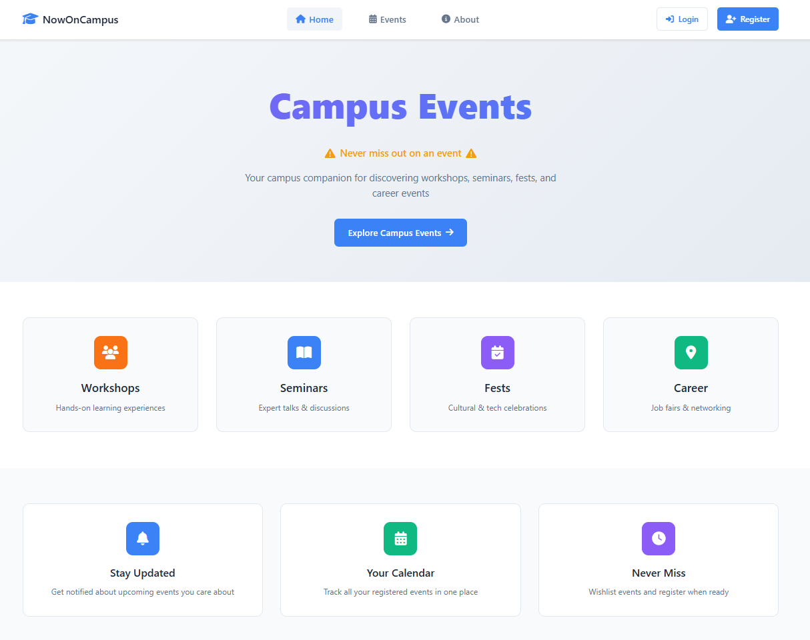
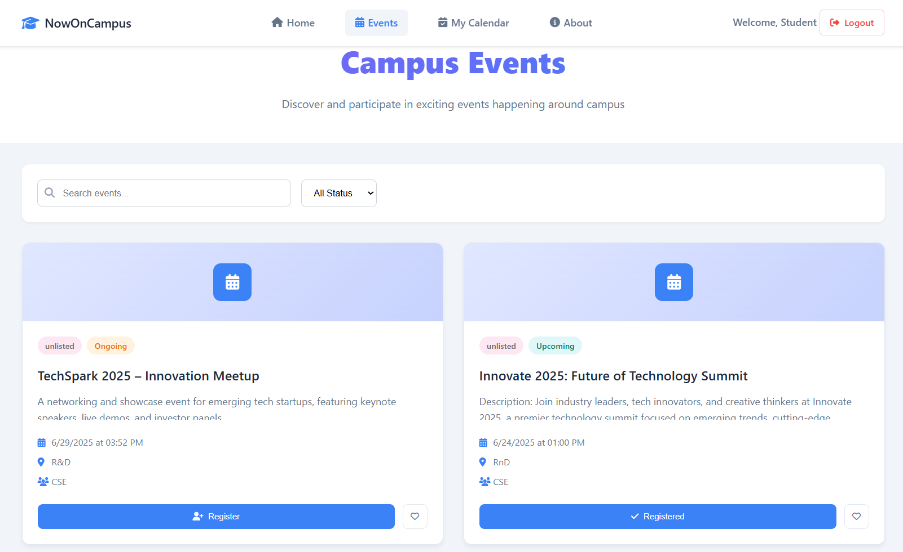
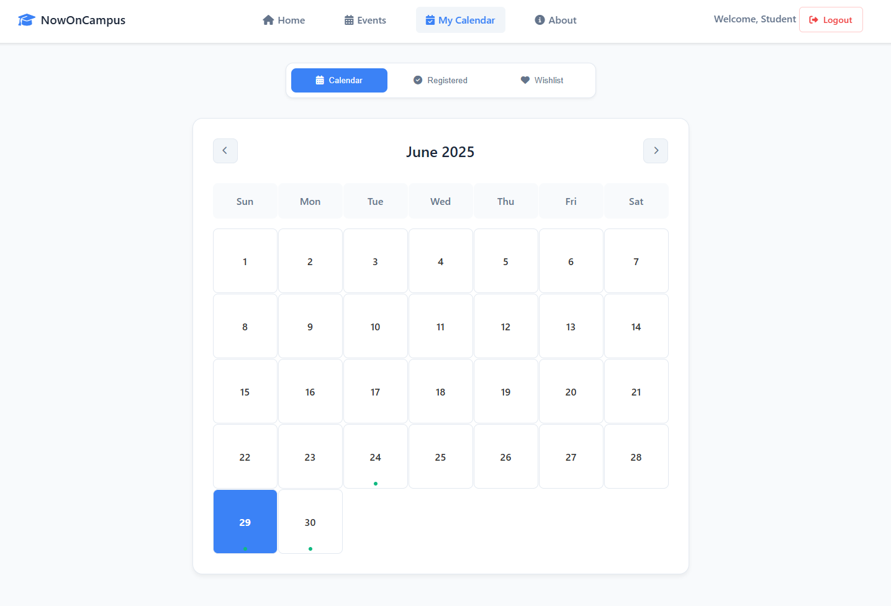
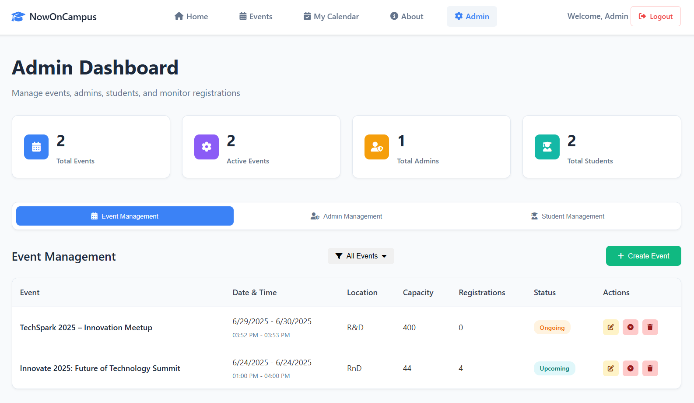
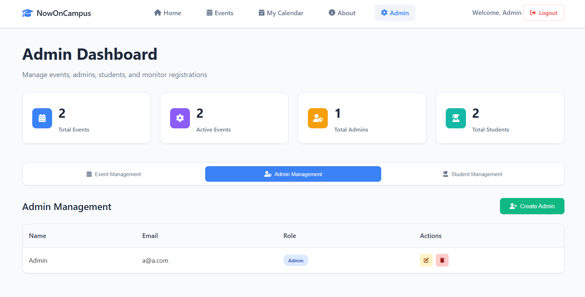
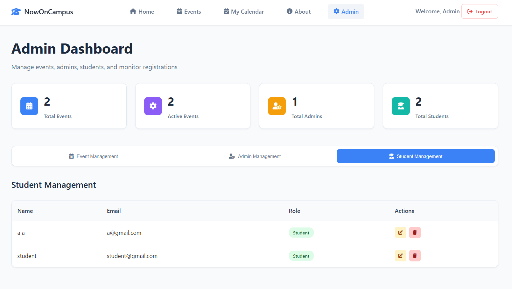

<div align="center">


# NowOnCampus

**A full-stack campus event management web application that helps students discover, register for, and track campus events — while giving administrators powerful tools to create and manage them.**

[Features](#-features) · [Screenshots](#-screenshots) · [Tech Stack](#-tech-stack) · [Database Schema](#-database-schema) · [API Reference](#-api-reference) · [Setup & Installation](#-setup--installation) · [Project Structure](#-project-structure) · [License](#-license)

</div>

---

## Overview

NowOnCampus bridges the gap between event organizers and students by providing a centralized platform for campus event discovery and management. Students can browse, filter, and register for events, save favorites to a wishlist, and track everything on a personal calendar — all with email confirmations at every step. Administrators get a full-featured dashboard to create, edit, cancel, and manage events and users.

---

## Features

### Student Portal
| Feature | Description |
|---|---|
| Browse & Filter Events | Search events by name, filter by type, department, or status (upcoming / ongoing / past / cancelled) |
| Event Details | View full event info — venue, organizer, agenda, capacity, and registration count |
| Event Registration | Register for events with a single click; receive an instant email confirmation |
| Wishlist | Save events to a personal wishlist for later |
| Personal Calendar | View all registered events on an interactive monthly calendar |
| Secure Auth | Sign up and log in with bcrypt-hashed passwords; session stored in `localStorage` |
| Email Notifications | Welcome email on signup; confirmation email on every event registration |

### Admin Dashboard
| Feature | Description |
|---|---|
| Stats Overview | Real-time counts of total events, active events, total admins, and total students |
| Create Events | Full form with name, date/time range, venue, type, department, capacity, organizer, agenda, and description |
| Edit Events | Update any event field, including manually setting event status |
| Cancel / Delete Events | Cancel an event (status update) or permanently delete it |
| Admin Management | Create new admin accounts, reset admin passwords, delete admins — each with email notifications |
| Student Management | View all student accounts, reset student passwords, delete students |

### General
- **Role-based navigation** — navbar dynamically renders based on whether the user is a student, admin, or guest
- **Responsive design** — desktop-first, accessible UI built with vanilla CSS
- **Consistent UI** — shared design tokens and component patterns across all pages

---

## Screenshots

### Home Page


### Events Listing


### Personal Calendar


### Admin — Event Management


### Admin — Admin Management


### Admin — Student Management


---

## Tech Stack

| Layer | Technology |
|---|---|
| **Frontend** | HTML5, CSS3 (Vanilla), JavaScript (ES6+) |
| **Icons** | Font Awesome 6.5 |
| **Backend** | Node.js, Express.js v5 |
| **Database** | MySQL 8 (via `mysql2`) |
| **Auth** | bcrypt (password hashing) |
| **Email** | Nodemailer (Gmail SMTP) |
| **Dev tooling** | nodemon, dotenv |

---

## Database Schema

The application uses four tables:

```sql
-- Users (students and admins)
CREATE TABLE users (
 id INT AUTO_INCREMENT PRIMARY KEY,
 name VARCHAR(100) NOT NULL,
 email VARCHAR(100) NOT NULL UNIQUE,
 password VARCHAR(255) NOT NULL,
 isAdmin TINYINT(1) DEFAULT 0 -- 0 = student, 1 = admin
);

-- Events
CREATE TABLE events (
 event_id INT AUTO_INCREMENT PRIMARY KEY,
 event_name VARCHAR(255) NOT NULL,
 start_datetime DATETIME NOT NULL,
 end_datetime DATETIME NOT NULL,
 venue VARCHAR(255) NOT NULL,
 event_type VARCHAR(100) DEFAULT 'unlisted',
 department VARCHAR(100),
 capacity INT NOT NULL,
 organiser_name VARCHAR(255),
 agenda TEXT,
 description TEXT NOT NULL,
 registrations INT DEFAULT 0,
 event_status ENUM('upcoming', 'ongoing', 'past', 'cancelled'),
 created_at TIMESTAMP DEFAULT CURRENT_TIMESTAMP,
 updated_at TIMESTAMP DEFAULT CURRENT_TIMESTAMP ON UPDATE CURRENT_TIMESTAMP
);

-- Event Registrations
CREATE TABLE register (
 user_id INT,
 event_id INT
);

-- Wishlist
CREATE TABLE wishlist (
 user_id INT,
 event_id INT
);
```

---

## API Reference

All API endpoints are served by the Express backend at `http://localhost:3000`.

### Auth
| Method | Endpoint | Description |
|---|---|---|
| `POST` | `/signup` | Register a new student; sends welcome email |
| `POST` | `/login` | Authenticate a user; returns user data + role |

### Admin Management
| Method | Endpoint | Description |
|---|---|---|
| `GET` | `/admins` | List all admin accounts |
| `POST` | `/createAdmin` | Create a new admin; sends welcome email |
| `POST` | `/updateAdminPassword` | Reset an admin's password |
| `POST` | `/deleteAdmin` | Delete an admin account |

### Student Management
| Method | Endpoint | Description |
|---|---|---|
| `GET` | `/students` | List all student accounts |
| `POST` | `/updateStudentPassword` | Reset a student's password |
| `POST` | `/deleteStudent` | Delete a student account |

### Events
| Method | Endpoint | Description |
|---|---|---|
| `GET` | `/events` | List all events (ordered by date descending) |
| `GET` | `/event/:id` | Get a single event by ID |
| `POST` | `/createEvent` | Create a new event |
| `POST` | `/updateEvent` | Update an existing event |
| `POST` | `/cancelEvent` | Set an event's status to `cancelled` |
| `POST` | `/deleteEvent` | Permanently delete an event |
| `GET` | `/adminStats` | Get platform statistics (event/user counts) |

### Registrations & Wishlist
| Method | Endpoint | Description |
|---|---|---|
| `POST` | `/registerEvent` | Register a user for an event; sends confirmation email |
| `POST` | `/unregisterEvent` | Unregister a user from an event |
| `GET` | `/userRegisteredEvents?user_id=` | Get all events a user is registered for |
| `POST` | `/wishlistEvent` | Add an event to a user's wishlist |
| `POST` | `/unwishlistEvent` | Remove an event from a user's wishlist |
| `GET` | `/userWishlist?user_id=` | Get all wishlisted events for a user |

---

## Setup & Installation

### Prerequisites
- [Node.js](https://nodejs.org/) v18+
- [MySQL](https://www.mysql.com/) 8+
- A Gmail account (for email notifications via Nodemailer)

### 1. Clone the Repository
```bash
git clone https://github.com/MAHanupriSAR/NowOnCampus.git
cd NowOnCampus
```

### 2. Install Dependencies
```bash
npm install
```

### 3. Configure Environment Variables

Create a `.env` file in the project root:
```env
GMAIL_USER=your-gmail-address@gmail.com
GMAIL_PASS=your-gmail-app-password
```

> **Note:** Use a [Gmail App Password](https://support.google.com/accounts/answer/185833), not your regular Gmail password. 2-Step Verification must be enabled on your Google account.

### 4. Configure the Database Connection

Open `server.js` and update the MySQL connection block with your credentials:
```js
const db = mysql.createConnection({
 host: 'localhost',
 user: 'root',
 password: 'your_mysql_password', // ← update this
 database: 'nowoncampus'
});
```

### 5. Set Up the Database

Create the database and import the schema:
```bash
mysql -u root -p -e "CREATE DATABASE nowoncampus;"
mysql -u root -p nowoncampus < local.session.sql
```

This creates all four tables and inserts a default admin account:
- **Email:** `admin@gmail.com`
- **Password:** `admin`

> **Change the default admin password immediately after setup.**

### 6. Start the Backend Server
```bash
node server.js
```

The API will be running at `http://localhost:3000`.

### 7. Open the Frontend

Open `html/home.html` directly in your browser, or serve the project root with a local static server (e.g. [Live Server](https://marketplace.visualstudio.com/items?itemName=ritwickdey.LiveServer) in VS Code).

---

## Project Structure

```
NowOnCampus/
 server.js # Express backend — all API routes
 local.session.sql # MySQL schema + seed data
 package.json
 .env # Environment variables (not committed)

 html/ # Frontend pages
 home.html # Landing page
 events.html # Event listing & search
 event_details.html # Individual event detail view
 calendar.html # Personal event calendar
 admin_func.html # Admin dashboard
 login.html # Login page
 signup.html # Student registration page
 about.html # About page

 css/ # Stylesheets (one per page)
 home.css
 events.css
 event_details.css
 my_calendar.css
 admin_func.css
 login.css
 signup.css
 about.css
 email.css # HTML email template styles

 javasccript/ # Frontend JavaScript (one per page)
 main.js # Shared: auth-aware navbar rendering
 events.js # Event listing, search, filter, wishlist
 event_details.js # Event detail view, register/wishlist actions
 calender.js # Calendar rendering + registered events
 adminDashboard.js # Admin dashboard logic
 login.js # Login form handling
 signup.js # Signup form handling

 screenshots/ # App screenshots for documentation
```

---

## Security Notes

- Passwords are hashed with **bcrypt** (10 salt rounds) before being stored.
- User session data (ID, name, email, role) is stored in `localStorage` after login.
- Role-based UI rendering is handled client-side; for production, consider adding JWT-based server-side route protection.
- Never commit your `.env` file — it is listed in `.gitignore`.

---

## License

This project is licensed under the [MIT License](LICENSE).

---

<div align="center">

Built with for campus communities by the NowOnCampus development team.

</div>